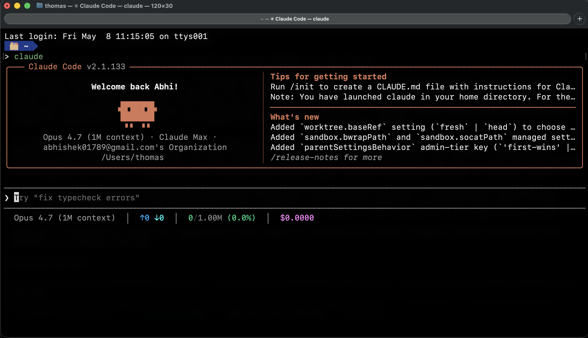

# claude-setup

My personal [Claude Code](https://claude.com/claude-code) setup — installs Claude Code and applies my settings + a colorized status line in one command.



The status line shows: **model · ↑input / ↓output tokens · used / window with progress bar and % · session cost**.

## Install

```bash
git clone git@github.com:dcrey7/claude-setup.git
cd claude-setup
./install.sh
```

The installer will:
1. Install Claude Code via `npm install -g @anthropic-ai/claude-code` if it's not already on your PATH.
2. Back up any existing `~/.claude/settings.json` to `settings.json.bak.<timestamp>`.
3. Drop `settings.json` and `statusline.sh` into `~/.claude/`.

The status line uses `jq` and `bc` — install with `brew install jq bc` if you don't already have them.

## Uninstall

```bash
./uninstall.sh                  # remove status line + restore previous settings
./uninstall.sh --remove-claude  # also npm-uninstall Claude Code itself
```

## Files

| File | What it does |
| --- | --- |
| `install.sh` | Installs Claude Code (if missing) and applies my config. |
| `uninstall.sh` | Removes the status line, restores previous settings. |
| `settings.json` | My `~/.claude/settings.json` — dark theme, status line wired up. |
| `statusline.sh` | The status line script (reads tokens from the transcript for accuracy). |
